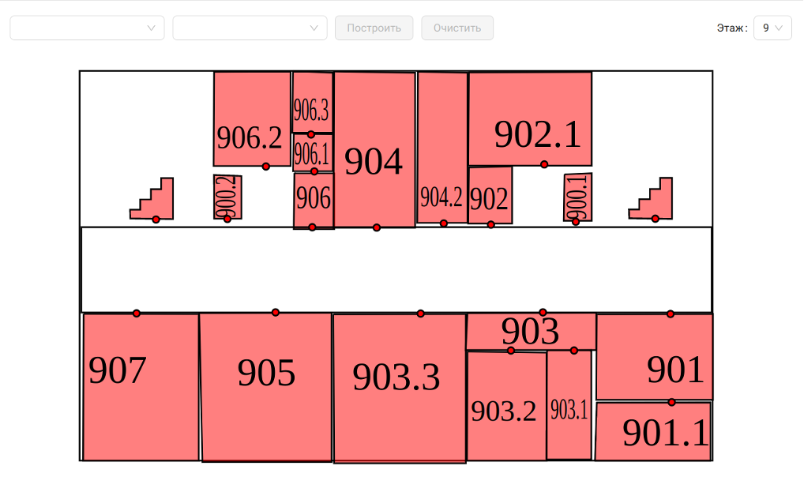

# Редактирование планов помещений

Приложение React для редактирования планов помещений

[Ссылка](https://iu5git.github.io/CampusMap/) на демо-версию приложения

## Описание интерфейса приложения

Страница редактора. На рисунке изображен интерфейс редактирования схем. Слева представлена панель инструментов (выделение, создание кривой, линии, текста, прямоугольника). В центре находится холст, куда можно размещать объекты. Сверху находится панель настроек объектов. Имеет модификации – характерные большие поля ввода с белым фоном. 

Создание точки аудитории. Для этого нужно выбрать точку (маленький элемент круга) на схеме. Если объект еще не был создан, то в верхнем меню будет активна кнопка плюсика. По нажатию отображается модальное окно создания объекта. Нужно выбрать тип объекта – Точка аудитории (дверь). После этого появятся координаты точки, которые заполняются автоматически. ID элемента также заполняется автоматически, вручную нужно ввести только название объекта.

Для создания связи нужно нажать на кнопку скрепки. Она станет активной (синего цвета), и появятся дополнительные поля ввода, изображенные на рисунке. Их можно заполнить вручную или автоматически, выбираю объекты на схеме. Поле вес, отвечающее за расстояние между объектами в большинстве случаев заполняется автоматически и присутствует для ручного ввода там, где это необходимо, например, создать связь между этажами, когда расстояние нельзя рассчитать. После заполнения всех полей следует нажать на кнопку галочки, и связь будет создана.
 

Обозреватель объектов в виде боковой панели изображен на рисунке. Активируется нажатием кнопки I (информация). Представляет из себя список всех объектов в системе с их названием, идентификатором, типом и этажом размещения. Присутствует кнопка удаления объекта. Также при наведении на элемент списка, соответствующий элемент объекта будет подсвечен зеленым цветом на схеме, это также отображено на рисунке – подсвечивается лестница.

Страница обозревателя схем изображена на рисунке. На ней находится интерактивная схема для активного этажа, переключатель этажей, расположенный в верхнем правом углу. И панель для задавания маршрута, которая располагается с левом верхнем углу. Она представляется из себя два поля для ввода точки от куда будет строиться маршрут и точки до куда будет строиться маршрут, кнопки построить маршрут и кнопки очистить, которая очищает поля ввода и стирает маршрут со схемы.
 

Поля ввода для задавания маршрута представляют из себя выпадающие списки с набором объектов и поиск по этим объектам. Пример работы изображен на рисунке. Поля работают интерактивно, поиски осуществляется после каждого введенного символа.

Интерактивные взаимодействия со схемой изображены на рисунке. Объекты, которые созданы и привязаны к элементам схемы подсвечиваются при наведении. По нажатию на них, заполняются поля задавания маршрута.

На рисунке изображено построение маршрута от аудитории 906.2 до аудитории 430. Были заполнены соответствующие поля и нажата кнопка Построить. На экране появились шаги маршрута в виде карточек, расположенных снизу. И был активирован первый шаг – проход на 9м этаже от аудитории 906.2 до лестницы, и соответствующем образом изображен на схеме. Далее говорится пройти с 9го этажа на 4ый, что является просто указанием и это не активный пункт. Далее идет финальный пункт прохода по 4му этажу. Его мы посмотрим на следующем рисунке.

Часть маршрута на 4м этаже изображена на рисунке. Попали в это состояние через выбор последнего шага, нажатием на карточку. Он стал активным и автоматическим образом схема переключилась на 4ый этаж и был проложен маршрут. 

## Алгоритм Дейкстры

Поскольку набор связей между точками представляет из себя взвешенный граф, где веса — это расстояния между точками, и веса неотрицательные, то для построения маршрута подойдет алгоритм Дейкстры. Он понятен, прост и не уступает в скорости аналогам в виде поиска в ширину и алгоритма Флойда.

Принцип работы алгоритма. Каждой вершине из множества вершин V сопоставим метку — минимальное известное расстояние от этой вершины до стартовой вершины a. Алгоритм работает пошагово — на каждом шаге он «посещает» одну вершину и пытается уменьшать метки. Работа алгоритма завершается, когда все вершины посещены.

Инициализация. Метка самой вершины a полагается равной 0, метки остальных вершин — бесконечности. Это отражает то, что расстояния от a до других вершин пока неизвестны. Все вершины графа помечаются как не посещённые.

Шаг алгоритма. Если все вершины посещены, алгоритм завершается. В противном случае, из ещё не посещённых вершин выбирается вершина u, имеющая минимальную метку. Мы рассматриваем всевозможные маршруты, в которых u является предпоследним пунктом. Вершины, в которые ведут рёбра из u, назовём соседями этой вершины. Для каждого соседа вершины u, кроме отмеченных как посещённые, рассмотрим новую длину пути, равную сумме значений текущей метки u и длины ребра, соединяющего u с этим соседом.

Если полученное значение длины меньше значения метки соседа, заменим значение метки полученным значением длины. Рассмотрев всех соседей, пометим вершину u как посещённую и повторим шаг алгоритма. Ниже изображен результат построения маршрута между аудиториями 907 и 906.2:

